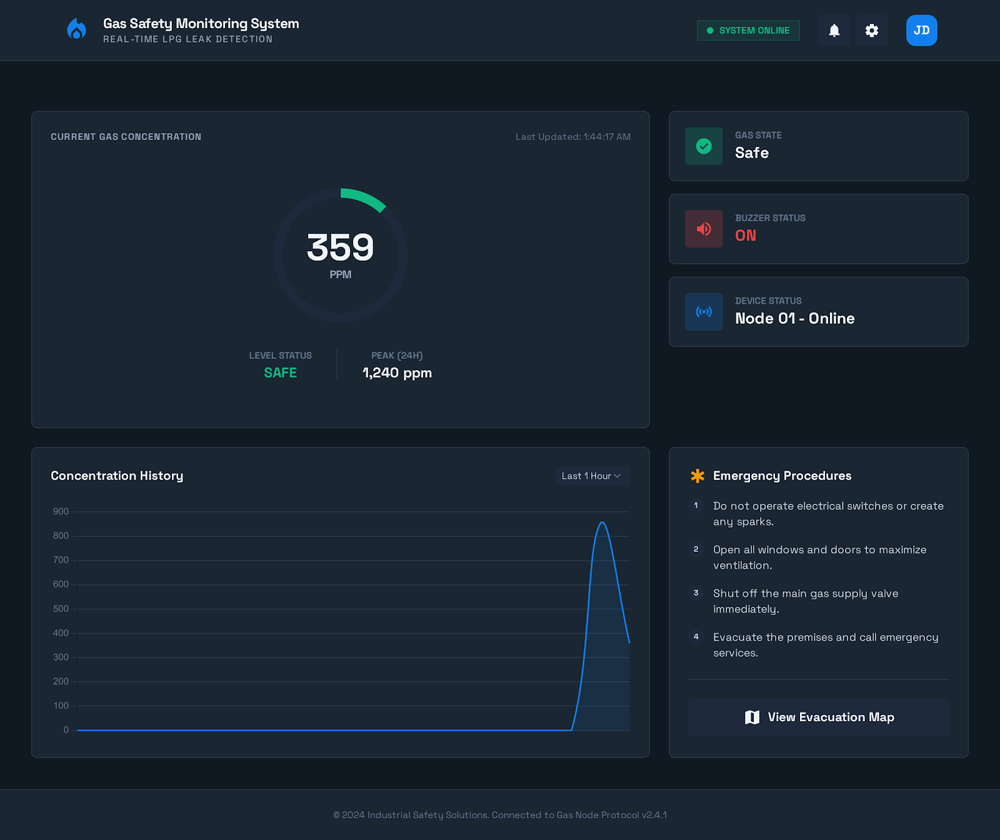
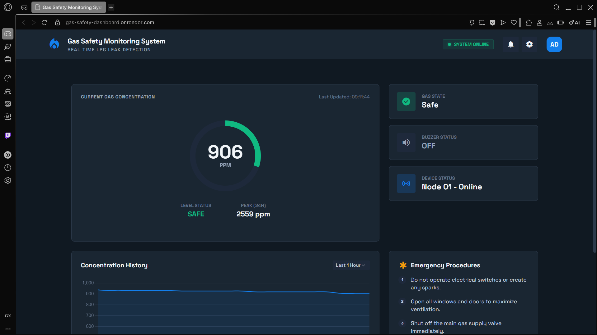
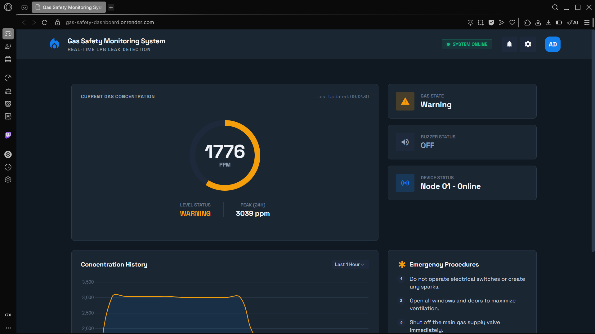
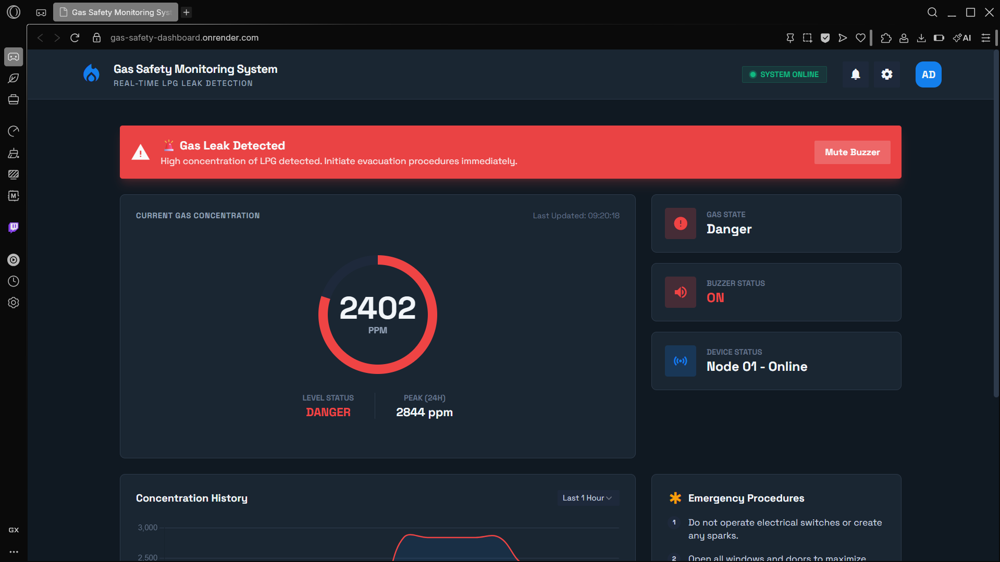

# 🔥 Gas Safety Monitoring System

A real-time LPG gas leak detection and alert system built with **ESP32**, **Flask**, and a **web-based dashboard**. The system monitors gas concentration levels, triggers physical safety mechanisms (servo valve shutoff, relay, buzzer), and sends email alerts when dangerous levels are detected.



---

## 📋 Table of Contents

- [Features](#features)
- [System Architecture](#system-architecture)
- [Gas Level States](#gas-level-states)
- [Hardware Components](#hardware-components)
- [Pin Configuration](#pin-configuration)
- [Software Setup](#software-setup)
- [Environment Variables](#environment-variables)
- [How It Works](#how-it-works)
- [API Endpoints](#api-endpoints)

---

## ✨ Features

- **Real-time gas monitoring** with live dashboard updates every second
- **Three-state detection system** — Safe, Warning, and Danger
- **Automatic gas valve shutoff** via servo motor when danger is detected
- **Buzzer alarm** with mute control from the web dashboard
- **Relay control** for additional safety mechanisms
- **Email alerts** via Brevo (formerly Sendinblue) API on high gas levels
- **Concentration history chart** with real-time graph
- **Responsive dark-themed dashboard** built with Tailwind CSS
- **Cloud deployment ready** (designed for Render)

---

## 🏗 System Architecture

```
┌──────────────┐        HTTP POST /update        ┌──────────────────┐
│   ESP32 +    │ ──────────────────────────────►  │  Flask Backend   │
│  MQ Gas      │                                  │  (backend.py)    │
│  Sensor      │  ◄──────────────────────────────  │                  │
│              │     JSON response (mute cmd)      │  Brevo Email API │
└──────────────┘                                  └────────┬─────────┘
   │  Servo (valve)                                        │
   │  Relay                                     GET /data  │
   │  Buzzer                                               ▼
                                                 ┌──────────────────┐
                                                 │  Web Dashboard   │
                                                 │  (index.html)    │
                                                 │  Polls every 1s  │
                                                 └──────────────────┘
```

---

## 🚦 Gas Level States

The system classifies gas concentration into three states:

### ✅ Safe (0 – 1000 ppm)

All systems nominal. No action required.



### ⚠️ Warning (Above 1000 ppm)

Elevated gas levels detected. Monitor closely.



### 🚨 Danger (Above 2000 ppm)

Critical gas concentration! The system automatically:
- Activates the **buzzer alarm**
- Rotates the **servo to shut off the gas valve**
- Triggers the **relay**
- Sends an **email alert**
- Displays an **alert banner** on the dashboard



---

## 🔧 Hardware Components

| Component         | Description                          |
|--------------------|--------------------------------------|
| ESP32              | Microcontroller with WiFi            |
| MQ Gas Sensor      | LPG/combustible gas detection        |
| Servo Motor        | Gas valve shutoff mechanism          |
| Relay Module       | Additional safety control (active low) |
| Buzzer             | Audible alarm                        |

---

## 📌 Pin Configuration

| Pin  | Component     |
|------|---------------|
| 34   | Gas Sensor (Analog) |
| 18   | Servo Motor   |
| 27   | Relay         |
| 26   | Buzzer        |

---

## 💻 Software Setup

### Prerequisites

- Python 3.x
- Arduino IDE (for ESP32 flashing)
- ESP32 board package installed in Arduino IDE

### Backend Setup

1. **Clone the repository**
   ```bash
   git clone https://github.com/your-username/gas-safety-dashboard.git
   cd gas-safety-dashboard
   ```

2. **Install dependencies**
   ```bash
   pip install -r requirements.txt
   ```

3. **Set environment variables** (see [Environment Variables](#environment-variables))

4. **Run the server**
   ```bash
   python backend.py
   ```
   The server starts on `http://localhost:5000`

### ESP32 Setup

1. Open `Gas_Safety_esp32Code.ino` in Arduino IDE
2. Update WiFi credentials:
   ```cpp
   const char* ssid = "YOUR_WIFI_SSID";
   const char* password = "YOUR_WIFI_PASSWORD";
   ```
3. Update the server URL to point to your deployed backend:
   ```cpp
   const char* serverName = "https://your-server-url.com/update";
   ```
4. Flash the code to your ESP32

---

## 🔐 Environment Variables

| Variable         | Description                              |
|------------------|------------------------------------------|
| `BREVO_API_KEY`  | API key for Brevo email service          |
| `EMAIL_SENDER`   | Sender email address for alerts          |
| `EMAIL_RECEIVER` | Recipient email address for alerts       |
| `PORT`           | Server port (default: 5000)              |

---

## ⚙️ How It Works

1. The **ESP32** reads the gas sensor value every 200ms
2. If gas stays **above 2000 ppm for 8 seconds**, the system activates:
   - Servo rotates to 90° (shuts gas valve)
   - Relay turns ON
   - Buzzer starts ringing
3. Data is sent to the **Flask backend** every 5 seconds via HTTP POST
4. The backend triggers an **email alert** via Brevo when gas exceeds the threshold
5. The **web dashboard** polls the backend every 1 second and updates the UI
6. If gas drops **below 1800 ppm**:
   - Buzzer turns off after 5 seconds
   - Full system resets after 60 seconds below threshold
7. The buzzer can be **muted remotely** from the dashboard

---

## 🌐 API Endpoints

| Method | Endpoint        | Description                        |
|--------|------------------|------------------------------------|
| GET    | `/`             | Serves the web dashboard           |
| GET    | `/data`         | Returns latest gas data as JSON    |
| POST   | `/update`       | Receives gas data from ESP32       |
| POST   | `/mute`         | Sends mute command to ESP32        |
| GET    | `/force-email`  | Triggers a test email alert        |
| GET    | `/health`       | Health check endpoint              |

---

## 📁 Project Structure

```
├── backend.py                  # Flask server & email logic
├── Gas_Safety_esp32Code.ino    # ESP32 Arduino code
├── requirements.txt            # Python dependencies
├── templates/
│   └── index.html              # Web dashboard
├── static/
│   └── screen.png              # Dashboard screenshot
└── Readme_images/
    ├── SAFE.png                # Safe state screenshot
    ├── WARNING.png             # Warning state screenshot
    └── DANGER.png              # Danger state screenshot
```
